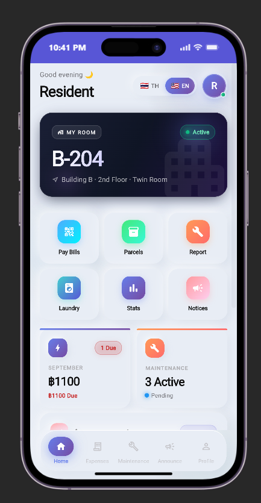
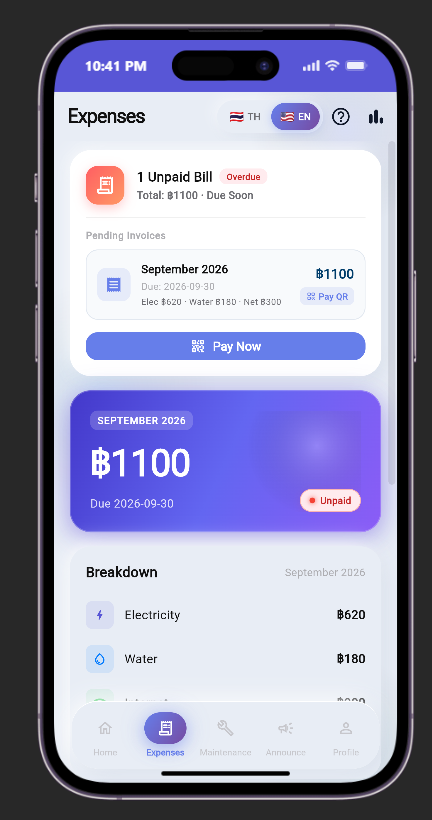
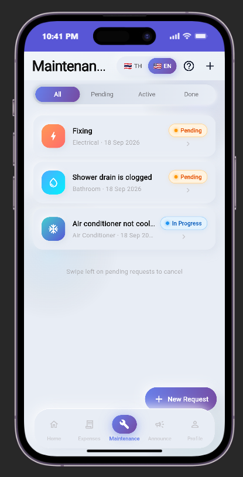
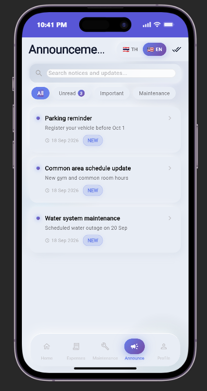
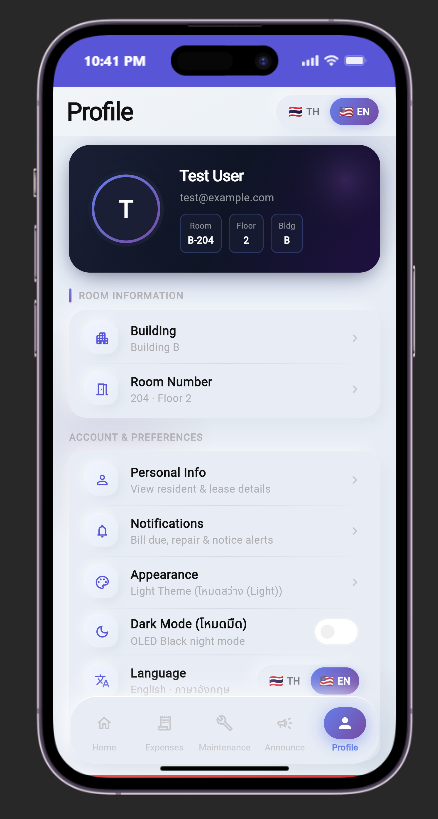

# DormMate

<p align="center">
  
</p>

DormMate is an enterprise-grade mobile application designed for dormitory and student residence management. It centralizes essential residential services into a unified digital experience, including utility billing with PromptPay QR generation, maintenance ticket tracking, parcel delivery notifications, amenity scheduling, and official administrative announcements.

The application is engineered strictly around the Model-View-ViewModel (MVVM) architecture with the Repository pattern and Service layer separation, ensuring strict decoupling, dependency injection via constructors, and comprehensive automated testability.

---

## Table of Contents

- [1. Executive Summary](#1-executive-summary)
- [2. System Architecture](#2-system-architecture)
- [3. Application Features (Core & Extra)](#3-application-features-core--extra)
- [4. Technology Stack](#4-technology-stack)
- [5. System Requirements](#5-system-requirements)
- [6. Installation and Setup Guide](#6-installation-and-setup-guide)
- [7. Demonstration Credentials](#7-demonstration-credentials)
- [8. Application Screenshots](#8-application-screenshots)
- [9. 🎬 Demonstration Video](#9--demonstration-video)
- [10. REST API Specification](#10-rest-api-specification)
- [11. Automated Testing and Quality Assurance](#11-automated-testing-and-quality-assurance)
- [12. Directory Structure](#12-directory-structure)
- [13. License and Attributions](#13-license-and-attributions)

---

## 1. Executive Summary

Dormitory residents frequently encounter fragmented communication channels, manual paper billing for utilities, and opaque maintenance request workflows. DormMate addresses these operational inefficiencies by providing:

- Real-time room occupancy and contract status visibility.
- Itemized utility tracking (electricity, water, internet, and facility surcharges) with automated PromptPay QR generation.
- Full lifecycle maintenance ticketing (submission, status progression, and cancellation).
- Administrative announcement distribution with category filtering and read state management.
- Shared facility and laundry machine availability tracking.
- Secure package delivery tracking with access PIN codes.
- OpenID Connect (OIDC) authentication with Authorization Code Flow and PKCE.
- Modern iOS-inspired glassmorphism user interface with dynamic theme presets and system-wide dark mode support.

---

## 2. System Architecture

DormMate implements a decoupled four-tier architecture designed for maintainability, predictable state progression, and complete isolation of concerns.

```
+-------------------------------------------------------------------------+
|                               VIEW LAYER                                |
|  Screens, Dialogs, Sheets, Reusable Glass Containers, Navigation Shell |
+-------------------------------------------------------------------------+
                                    |
                                    v (User Actions / State Listeners)
+-------------------------------------------------------------------------+
|                            VIEWMODEL LAYER                              |
|  ChangeNotifier implementations managing reactive UI state and business |
|  validation. ViewModels never import network or storage primitives.    |
+-------------------------------------------------------------------------+
                                    |
                                    v (Constructor Injection)
+-------------------------------------------------------------------------+
|                           REPOSITORY LAYER                              |
|  Abstract contracts and concrete implementations mediating data between |
|  remote APIs, local caches, and domain entity models.                   |
+-------------------------------------------------------------------------+
                                    |
                                    v (Constructor Injection)
+-------------------------------------------------------------------------+
|                            SERVICE LAYER                                |
|  Stateless network clients (Dio), secure keystore managers, and OIDC    |
|  protocol orchestrators (PKCE, token refreshing).                       |
+-------------------------------------------------------------------------+
```

### Architectural Principles

1. **Model-View-ViewModel (MVVM)**: Views observe ViewModels through the `provider` package (`ChangeNotifierProvider` and `ListenableBuilder`). Business rules and state mutations reside exclusively within ViewModels.
2. **Repository Pattern**: ViewModels interact only with repository interfaces (`RoomRepository`, `ExpenseRepository`, `MaintenanceRepository`, etc.). This enables seamless swapping between production implementations and test doubles (`FakeRepository`).
3. **Constructor-Based Dependency Injection**: Concrete service and repository instances are instantiated during application bootstrapping (`main.dart`) and injected downward via constructor parameters. Service locators and global mutable singletons are avoided.
4. **State Machine Predictability**: ViewModels expose clear state indicators (`isLoading`, `errorMessage`, `isEmpty`) to render appropriate deterministic UI states (skeletons, empty states, retry views).

---

## 3. Application Features (Core & Extra)

### 3.1 🎯 Core Features (ฟีเจอร์หลัก — 15 คะแนน)

1. **Authentication (OIDC & SSO)**:
   - Standards-compliant OpenID Connect (OIDC) Authorization Code Flow with PKCE against `django-oidc-provider`.
   - Token persistence via `flutter_secure_storage` ensuring sessions survive page refreshes and app restarts.
   - Global Route Guarding via `go_router` preventing unauthorized access to protected screens.
   - Complete Logout session and token invalidation.
2. **Create (บันทึกข้อมูลใหม่)**:
   - Form submission for maintenance requests with multi-field validation (Title, Category, Description, Urgency level, Preferred time slot, and Photo attachment).
3. **Read (ดึงและแสดงผลข้อมูล)**:
   - Comprehensive Room Profile & Occupancy details.
   - Itemized utility statements (Electricity, Water, Internet, Rent) with granular consumption metrics.
   - Maintenance ticket list and detailed step-by-step progress timeline.
   - Administrative notice board with unread indicators.
4. **Update / Delete (แก้ไขและลบข้อมูล)**:
   - Ability for residents to cancel/delete pending maintenance tickets directly from the detail view.
5. **Error Handling (การจัดการข้อผิดพลาด)**:
   - Graceful user feedback via SnackBar notifications and responsive `StateViews.error` with Retry functionality when network or API fails.

### 3.2 ✨ Extra Features (ฟีเจอร์เสริม — 10 คะแนน)

1. **🌙 System-wide Dark Mode & Dynamic Theme Presets**:
   - 5 curated glassmorphism themes: Classic Navy, Emerald Oasis, Royal Violet, Rose Quartz, and Dark Slate.
   - Real-time Light/Dark mode switcher with persistent preference saved across sessions.
2. **🌐 Real-Time Dual-Language (i18n)**:
   - Instant language switching between **Thai 🇹🇭** and **English 🇬🇧** throughout all views, forms, sheets, and dialogs.
3. **💳 Utility Analytics & Automated PromptPay QR**:
   - Monthly energy and water consumption analytics charts.
   - EMVCo-compliant PromptPay QR code generator for instant cashless utility payments.
4. **🔍 Real-Time Search, Filtering & Categorization**:
   - Interactive search and category chip filters for administrative announcements.
   - Real-time parcel locker package search by tracking code, carrier, and recipient name.
5. **🧺 Shared Facility & Laundry Monitor**:
   - Real-time availability simulation for washing machines and dryers with countdown timers.
6. **📦 Smart Parcel Locker Simulation**:
   - Locker box assignment with secure one-time retrieval PIN codes.

---

## 4. Technology Stack

### Client (Mobile and Web)
- **Language**: Dart (v3.8 or newer)
- **Framework**: Flutter (v3.24 or newer)
- **State Management**: `provider` (^6.1.2)
- **Declarative Routing**: `go_router` (^14.8.1)
- **HTTP Client**: `dio` (^5.8.0)
- **Identity Protocol**: `openid_client` (^0.4.10)
- **Encrypted Storage**: `flutter_secure_storage` (^9.2.4)
- **Vector Assets**: `flutter_svg` (^2.0.17)
- **Localization and Formatting**: `intl` (^0.20.2)

### Server (Backend)
- **Runtime**: Python (v3.12 or newer)
- **Package Manager**: `uv` (Fast Python package resolver and virtual environment manager)
- **Web Framework**: Django 5.x
- **API Engine**: Django REST Framework (DRF)
- **Identity Server**: `django-oidc-provider` (OAuth 2.0 / OIDC Authorization Code Flow with PKCE, RS256 cryptographic signing)
- **Relational Database**: SQLite (Default development instance)

---

## 5. System Requirements

Before setting up the environment, verify that the following dependencies are installed on your workstation:

1. **Git**: Distributed version control ([Download Git](https://git-scm.com/downloads))
2. **Flutter SDK**: Version 3.24.0 or higher ([Install Flutter](https://docs.flutter.dev/get-started/install))
3. **Python**: Version 3.12 or higher ([Install Python](https://www.python.org/downloads/))
4. **uv**: High-performance Python package installer ([Install uv](https://docs.astral.sh/uv/getting-started/installation/))
   - Windows (PowerShell):
     ```powershell
     powershell -ExecutionPolicy ByPass -c "irm https://astral.sh/uv/install.ps1 | iex"
     ```
   - macOS / Linux:
     ```bash
     curl -LsSf https://astral.sh/uv/install.sh | sh
     ```
5. **Google Chrome**: Recommended target browser for Web client execution ([Download Chrome](https://www.google.com/chrome/))

---

## 6. Installation and Setup Guide

Execute the following commands from clean shell sessions.

### Step 1: Repository Clone

```bash
git clone https://github.com/Pudcharapx/Mobiledev69.git
cd Mobiledev69
git checkout project
```

### Step 2: Backend Setup and Database Initialization (Terminal 1)

Navigate to the `backend/` directory, install virtual environment dependencies, apply migrations, seed initial data, and launch the development server:

```bash
cd backend

# Synchronize Python dependencies
uv sync

# Execute database migrations
uv run python manage.py migrate

# Initialize OIDC RSA keys and client registration
uv run python manage.py bootstrap_oidc

# Seed default DormMate rooms, residents, bills, and announcements
uv run python manage.py bootstrap_dormmate

# Start the Django REST API server on port 8000
uv run python manage.py runserver 8000
```

The Django server will accept incoming HTTP requests at `http://127.0.0.1:8000/`.

### Step 3: Frontend Client Execution (Terminal 2)

From the project root directory (`Mobiledev69`), resolve Flutter dependencies and run the application:

```bash
# Retrieve Flutter package dependencies
flutter pub get

# Launch Flutter Web in Google Chrome on port 50000
flutter run -d chrome --web-port=50000
```

*Note: Port `50000` corresponds to the pre-authorized redirect URI registered in the OIDC client configuration (`http://localhost:50000/callback`).*

To target a desktop or mobile emulator instead:

```bash
# List available platforms and emulators
flutter devices

# Run on selected device target (e.g. Windows desktop)
flutter run -d windows
```

---

## 7. Demonstration Credentials

The database bootstrapping command (`bootstrap_dormmate` and `bootstrap_oidc`) creates pre-seeded accounts configured with corresponding residential profiles:

| Role | Username | Password | Email | Assigned Room | Room Type |
|---|---|---|---|---|---|
| Primary Resident | `demouser` | `demo12345` | `demo@example.com` | Room A-101 | Single |
| Secondary Resident | `test` | `1234` | `test@example.com` | Room B-204 | Twin |

---

## 8. Application Screenshots

| Resident Home | Expenses & Utility Bills | Maintenance Tracking |
|:---:|:---:|:---:|
|  |  |  |
| *Resident overview, contract info, quick actions* | *Itemized utilities, overdue bill alert, PromptPay* | *Maintenance tickets, urgency badges, status tabs* |

| Administrative Announcements | Resident Profile & Settings |
|:---:|:---:|
|  |  |
| *Official dorm updates, category filters, unread badges* | *Personal info, appearance presets, Dark Mode, i18n* |

---

## 9. 🎬 Demonstration Video

- **Video URL:** [https://youtu.be/JkXWX4Gf0c8](https://youtu.be/JkXWX4Gf0c8)
- **Duration:** 5–8 minutes
- **Complete Storyboard & Script:** See [docs/SPEAKING_SCRIPT.md](docs/SPEAKING_SCRIPT.md) for the word-for-word presenter script and [docs/VIDEO_SCRIPT.md](docs/VIDEO_SCRIPT.md) for technical presentation criteria.

### Video Presentation Timeline

| Timestamp | Phase | Topic | Key Verification Items |
|---|---|---|---|
| **0:00 – 0:30** | Phase 1 | Project Overview & Git Branch | Show GitHub repository, verify `git branch --show-current` outputs `project`, briefly show README |
| **0:30 – 2:30** | Phase 2 | Zero-Error Setup | 2 Terminals: Terminal 1 (`backend`: `uv sync`, `migrate`, `bootstrap_oidc`, `bootstrap_dormmate`, `runserver 8000`) and Terminal 2 (`flutter run -d chrome --web-port 50000`). Zero errors. |
| **2:30 – 3:30** | Phase 3 | OIDC Authentication & Route Guard | Route guard blocks unauthenticated access; Click OIDC Login; browser redirects to Django OIDC login; login with demo user; consent; redirect back to `localhost:50000/callback`; token stored; session persists on browser refresh; logout cleans session |
| **3:30 – 5:30** | Phase 4 | Main Functions (CRUD + Error Handling) | Create maintenance request with validation; view list & timeline; cancel request; demonstrate error handling (e.g. stop backend and attempt fetch) |
| **5:30 – 7:00** | Phase 5 | Extra Features & Conclusion | Dark mode & theme presets; Thai/English language toggle; PromptPay QR generation; package locker search; conclusion |

---

## 10. REST API Specification

All endpoints are hosted under `/api/dormmate/` and expect JSON payloads.

| HTTP Method | Endpoint Path | Description | Access Control |
|---|---|---|---|
| `POST` | `/api/dormmate/auth/login/` | Direct token authentication fallback | Public |
| `GET` | `/api/dormmate/profile/` | Retrieve current resident personal details | Authenticated |
| `GET` | `/api/dormmate/rooms/me/` | Retrieve resident room information and roommates | Authenticated |
| `GET` | `/api/dormmate/expenses/` | List all utility and room billing records | Authenticated |
| `GET` | `/api/dormmate/expenses/<id>/` | Retrieve granular itemized billing record | Authenticated |
| `GET` | `/api/dormmate/maintenance/` | List resident maintenance tickets | Authenticated |
| `POST` | `/api/dormmate/maintenance/` | Submit a new maintenance ticket | Authenticated |
| `GET` | `/api/dormmate/maintenance/<id>/` | Retrieve maintenance ticket detail | Authenticated |
| `DELETE` | `/api/dormmate/maintenance/<id>/` | Cancel a pending maintenance ticket | Authenticated |
| `GET` | `/api/dormmate/announcements/` | Retrieve all administrative announcements | Authenticated |
| `GET` | `/api/dormmate/announcements/<id>/` | Retrieve announcement details | Authenticated |
| `GET` | `/api/dormmate/dashboard/` | Aggregated payload for the Home screen | Authenticated |

---

## 11. Automated Testing and Quality Assurance

The codebase maintains strict verification coverage across both frontend and backend layers.

### Frontend Test Suite (Flutter)

The Flutter test suite encompasses unit tests for business models, fake repository state tests for ViewModels, and widget rendering verification for UI screens:

```bash
# Run all automated Flutter unit and widget tests
flutter test

# Run static analysis and lint rule enforcement
flutter analyze
```

Expected output:
- **120 automated tests passed** with zero failures.
- Static analyzer reports **0 issues**.

### Backend Test Suite (Django)

```bash
cd backend
uv run python manage.py test
```

---

## 12. Directory Structure

```
Mobiledev69/
├── backend/
│   ├── config/                     # Django core settings, URL routing, WSGI/ASGI
│   │   ├── settings.py
│   │   └── urls.py
│   ├── dormmate/                   # DormMate REST API application
│   │   ├── management/commands/    # Data bootstrap commands (bootstrap_dormmate)
│   │   ├── migrations/             # Database schema migrations
│   │   ├── models.py               # Room, Resident, Expense, Maintenance, Announcement
│   │   ├── serializers.py          # DRF model serializers
│   │   ├── urls.py                 # Endpoint routing rules
│   │   └── views.py                # Class-based API view controllers
│   ├── manage.py                   # Django CLI executable
│   └── pyproject.toml              # uv Python environment and dependencies
├── lib/
│   ├── core/                       # Cross-cutting concerns
│   │   ├── auth/                   # OIDC Authorization Code Flow, PKCE, TokenStorage
│   │   ├── constants/              # Dimension, color, and string constants
│   │   ├── localization/           # Bilingual language switcher (LanguageService)
│   │   ├── routing/                # GoRouter declarative configuration + Route Guard
│   │   ├── services/               # Shared device utilities
│   │   ├── theme/                  # Theme presets, glassmorphism specs, ThemeService
│   │   └── widgets/                # Reusable glass cards, mesh backgrounds, navbars
│   ├── models/                     # Immutable domain data transfer objects (DTOs)
│   ├── repositories/               # Repository interfaces and concrete implementations
│   ├── services/                   # Stateless network and storage services (ApiService, AuthService)
│   ├── viewmodels/                 # ChangeNotifier MVVM controllers
│   ├── views/                      # UI screens partitioned by domain feature
│   │   ├── announcements/          # Announcement list, details, search
│   │   ├── auth/                   # OIDC Login interface & Callback handler
│   │   ├── expenses/               # Utility breakdowns and PromptPay QR sheets
│   │   ├── facility/               # Laundry and shared amenity monitors
│   │   ├── home/                   # Resident dashboard
│   │   ├── maintenance/            # Ticket CRUD, forms, timeline status
│   │   ├── parcels/                # Package arrival and locker PINs
│   │   └── profile/                # Profile management and theme picker
│   └── main.dart                   # Application entrypoint and dependency injection graph
├── test/
│   ├── core/                       # Theme, localization, and core widget unit tests
│   ├── fake_repositories/          # In-memory test doubles for ViewModel testing
│   ├── viewmodels/                 # ViewModel business logic and state tests
│   ├── views/                      # Widget tests validating screen behavior
│   └── dormmate_app_smoke_test.dart# End-to-end routing and provider smoke tests
├── docs/                           # Documentation, screenshots, and video script
│   ├── screenshots/                # Application UI screenshots
│   └── VIDEO_SCRIPT.md             # Storyboard and presentation script
├── web/                            # Web platform bootstrapping, manifest, index.html
├── pubspec.yaml                    # Flutter dependencies and asset registrations
├── DormMate_SRS.md                 # Complete Software Requirements Specification
└── README.md                       # Project technical documentation
```

---

## 13. License and Attributions

This project is developed for academic and demonstration purposes as part of the Mobile Application Development curriculum. All rights reserved.
